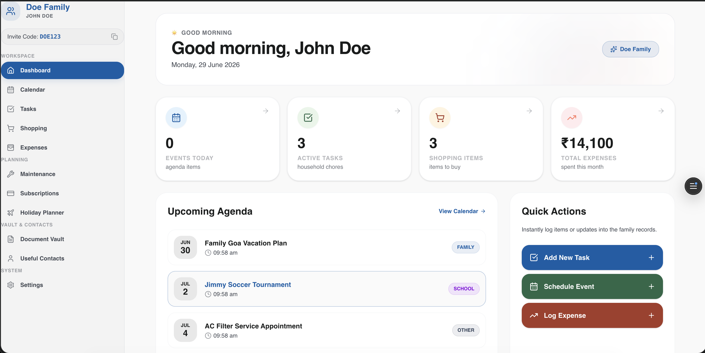
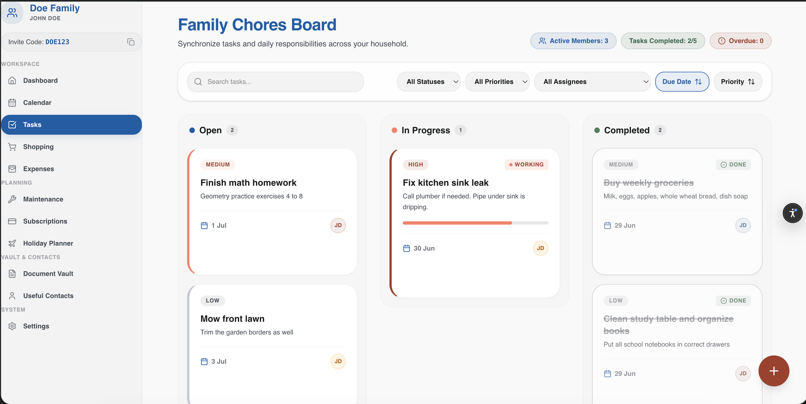
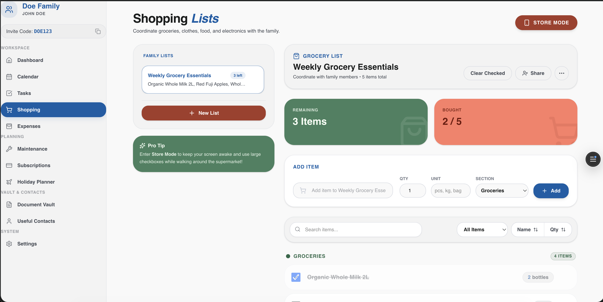
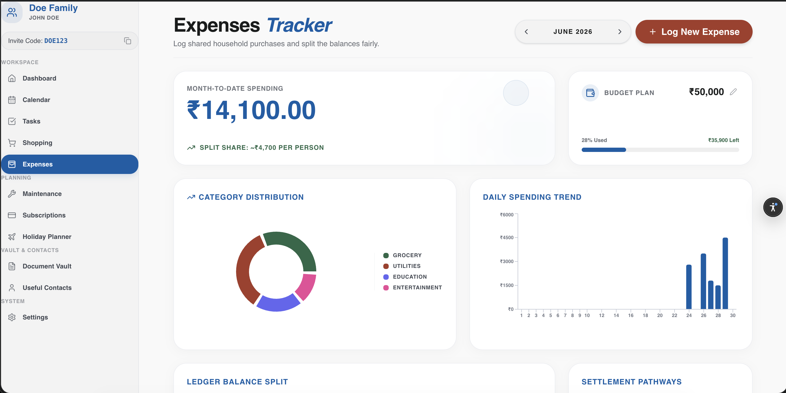
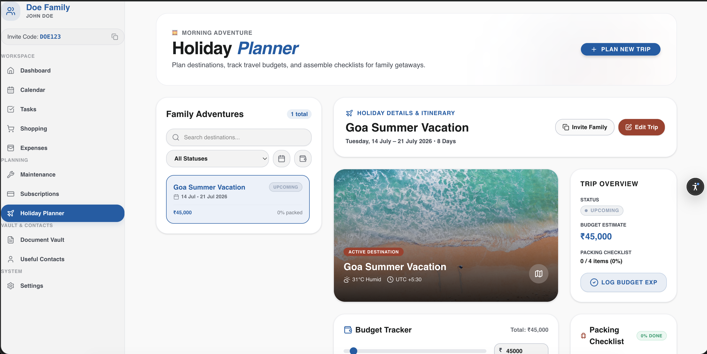
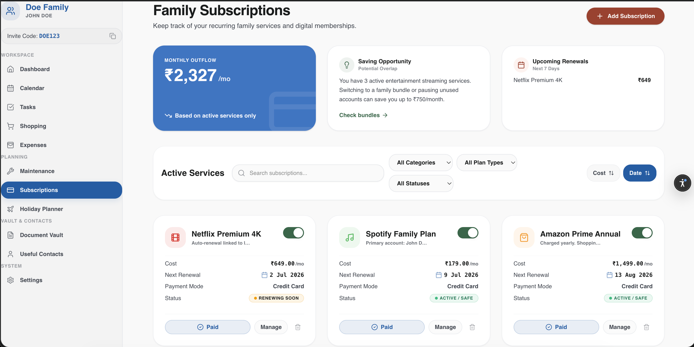
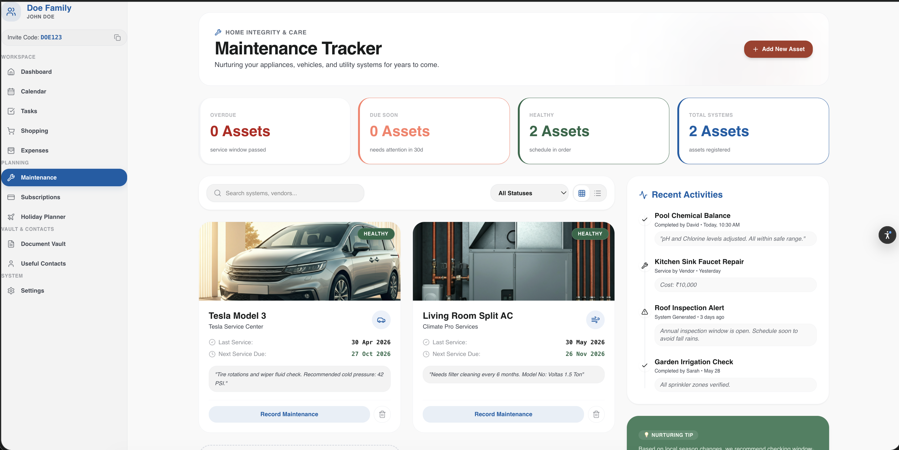

# 🏡 FamAssist (Family Organizer)

<p align="center">
  
</p>

[](https://nextjs.org)
[](https://supabase.com)
[](https://tailwindcss.com)
[](https://typescriptlang.org)
[](https://vercel.com)

**FamAssist** is a premium, private web application designed to help modern families organize, synchronize, and simplify their daily lives. From chore tracking and shared calendars to budgeting, active subscription monitoring, holiday planning, and home asset maintenance—FamAssist acts as the digital home base for your family.

---

## 🌟 Modules & Feature Showcase

### 📊 Dashboard
An interactive command center displaying today's schedule, chores breakdown, shopping lists, monthly expenses, and active reminders. Fits into a sleek Bento grid with responsive cards.
<p align="left">
  
</p>

### 🧹 Task & Chore Tracker
Create chores, set priorities (Low, Medium, High), assign them to family members, and track status (`Open`, `In Progress`, `Completed`) dynamically.
<p align="left">
  
</p>

### 🛒 Smart Shopping
Create shopping lists, add items with quantities and categories, and check them off in real-time. Includes progress tracking and one-click cleanup of bought items.
<p align="left">
  
</p>

### 💳 Expenses & Budget Analytics
Log monthly expenditures, view spending analytics by category, and track family spending against a shared monthly budget with responsive progress meters.
<p align="left">
  
  
</p>

### 🔔 Subscriptions Monitor
Monitor active services (Netflix, Spotify, Amazon Prime, etc.), track billing cycles, costs, and display upcoming renewal dates automatically.
<p align="left">
  
</p>

### 🔧 Home Asset Maintenance
Keep home systems (AC, Water Filter, Vehicles) running smoothly. Log service costs, record last service dates, track next due dates, and auto-log service fees directly to family expenses.
<p align="left">
  
</p>

---

## ⚙️ Engineering & Performance Highlights

This app is built to be secure, production-grade, and responsive.

### 1. 🏎️ Sub-100ms Page Navigation (Zustand Cache)
Standard server-rendered pages suffer from query waterfalls (e.g., waiting for session Auth -> fetching user -> fetching family -> fetching data). We integrated a **Zustand global cache** that pre-warms on initial load. Subsequent page changes read context instantly, eliminating redundant database roundtrips and yielding a **100/100 Vercel Speed Performance** score.

### 2. ⚡ Postgres Plan Cache Tuning
To optimize Row-Level Security (RLS) evaluation on high-traffic tables, all policies have been rewritten to use subquery evaluations:
```sql
USING (created_by = (SELECT auth.uid()))
```
By placing `auth.uid()` inside a `(SELECT ...)` subquery, Postgres is forced to evaluate the current session variable exactly once per query (as an `InitPlan`) and cache it, rather than calling the user evaluation function for every single row scanned.

### 3. 🔒 SQL Injection & RPC Hardening
All PostgreSQL custom database functions are hardened to execute strictly under a secure path:
```sql
ALTER FUNCTION public.is_family_member(uuid) SET search_path = public, pg_temp;
```
Execution privileges on helper functions used by the backend are revoked from default `public` and guest `anon` roles to restrict direct RPC endpoint exposure.

### 4. 📈 Covering Database Indexes
Added covering B-Tree indexes for all foreign key relationships (e.g., `family_id`, `created_by`, `paid_by`) to ensure joins and cascaded deletions run at `O(log N)` complexity.

---

## 🚀 Setup & Installation

### 1. Clone & Install Dependencies
```bash
git clone https://github.com/Vinay0905/Family_dashboard.git
cd Family_dashboard/family-organizer
npm install
```

### 2. Configure Environment Variables
Create a `.env.local` file in the `family-organizer` directory:
```env
NEXT_PUBLIC_SUPABASE_URL=your_supabase_project_url
NEXT_PUBLIC_SUPABASE_ANON_KEY=your_supabase_anon_key
```

### 3. Initialize Database & Seed Demo Data
1. Copy the contents of [`supabase_schema_complete.sql`](../supabase_schema_complete.sql) and paste them into your **Supabase SQL Editor** to create the tables, types, indexes, and RLS rules.
2. Execute the [`seed_doe_family.sql`](./supabase/seed_doe_family.sql) script in the SQL editor to pre-populate the **Doe Family** test accounts and demo data.
3. Start the local server:
   ```bash
   npm run dev
   ```

---

## 👥 Demo Family Credentials

Log in using any of the following accounts to see the pre-populated dashboard:

* **Father / Family Admin**: 
  * **Email**: `nagavinay0905@gmail.com`
  * **Password**: `password123`
* **Mother / Family Member**:
  * **Email**: `nagavinay.avvaru@gmail.com`
  * **Password**: `password123`
* **Child / Family Child**:
  * **Email**: `kingler2510@gmail.com`
  * **Password**: `password123`

---

> [!TIP]
> Log in as **John Doe** (`nagavinay0905@gmail.com`) to access admin settings (like adding members or changing the family name). Log in as **Jimmy Doe** (`kingler2510@gmail.com`) to view the app through a child's chore list!
